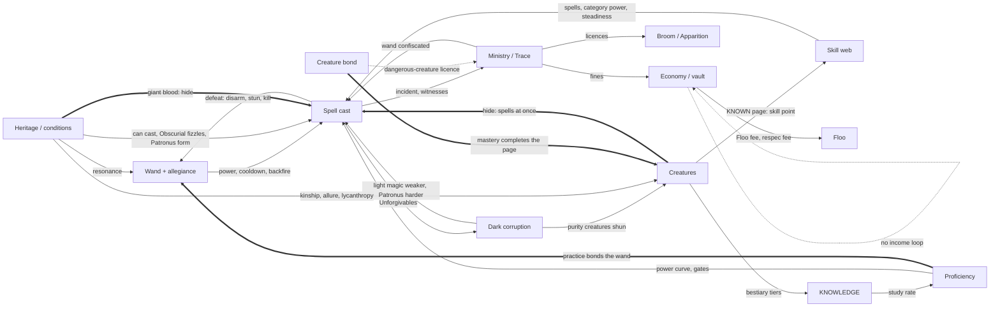

# Wizards & Beasts — System Interaction Map

Where the mod's systems talk to each other on `dev` (2026-09-28), where they should and did not, and where they are
kept apart on purpose. Every connection had to answer one question: **does it create gameplay a player can see and
act on?** Arbitrary multipliers, hidden bonuses and dependencies that exist because they could are refused.

Companion documents: `PROGRESSION_MAP.md` (the progression loop), `HERITAGE_IDENTITY_STATUS.md`,
`CREATURE_IDENTITY_STATUS.md`, `DEVELOPER_REFERENCE.md` (spell power, standing, heritage layers).

---

## 1. The graph

Solid edges exist. Bold edges were added in this pass. Dotted edges are missing and recorded in §4.

## 2. Existing interactions

| Pair | Mechanism | Where | Verdict |
|---|---|---|---|
| Wand ↔ casting | Bond state sets power and cooldown: 0.70× in another wizard's hand, 0.85× reluctant, 1.10× mastered, 1.35× for the mastered Elder Wand. A broken wand always backfires, and a hawthorn wand backfires for a stranger. Unicorn-hair and rowan wands lose bond to the Dark Arts, blackthorn bonds only in danger, and thestral hair needs a witness of death. | `WandAllegianceRules`, `WandCastingAllegianceSystem`, `SpellCastService` | Real. It changes every cast and the tooltip names the state |
| Spells → wand | A defeat (Expelliarmus, a Stupefy that lands, a kill) moves the wand toward the victor. A cast by the master answers the challenge. | `WandAllegianceService` | Real |
| Heritage → wand | Traits shape wood and core compatibility at Ollivander's trial: obscurus, allure, kinship, moon-sensitive, goblin rebellions, rune affinity. | `wand/cast/Compatibility`, `WandResonanceSystem` | Real (choice of wand) |
| Wand stats → casting | Wood and core `cast_modifiers` and fizzle chance. | `WandStatsResolver` | Real |
| Proficiency ↔ spells | Tiers gate spell chains; the power curve scales damage, cooldown and duration. | `SpellPractice`, `ProficiencyScaler` (`PROGRESSION_MAP.md`) | Real |
| Creatures → proficiency | Bestiary tiers raise KNOWLEDGE, and KNOWLEDGE is the study rate on the power curve. | `KnowledgeFormula`, `SpellProficiencyTracker.studyRate` | Real |
| Skill web → casting | Teaches spells, lowers early gates, sets category power and steadiness (less misfire). | `SkillSystemAPI.applySkillModifiers` | Real |
| Heritage / conditions → casting | No wand or no casting, Obscurial fizzles and dark-form-only spells, Patronus form from heritage, innate Apparition, `can_legilimise`. | `PlayerHeritageData.canCast/canUseWand`, `ObscurialRules`, `PatronusFormDeterminer` | Real |
| Dark Arts → corruption | Avada Kedavra stains at cast; Crucio stains per held tick, scaled by intent; Imperio stains when control seizes. Horcrux and diary ink stain too. | `UnforgivableToll`, `DarkCorruptionService` | Real |
| Corruption → consequences | At 90 or more, Defence and Utility spells hit at 0.7×. Every point weakens the Patronus. At 60 or more, mental stability is capped at 80. Crucio intent rises with corruption. Unicorns and other purity-sensitive creatures shun or flee. The standing ALIGNMENT axis follows it. | `SpellExecutor`, `ExpectoPatronum`, `SignatureSpellPlayerTickHandler`, `WildlifeRules`, `StandingService` | Real. Corruption is a consequence, not a meter |
| Ministry ↔ illegal magic | `spell_law` classes (unrestricted, restricted, dark, Unforgivable). A cast becomes an incident only through witnesses, the Trace or a wand examination, and is judged at a hearing. Unforgivables carry a sentence, secrecy breaches a fine, underage magic a caution. | `MinistryTrace`, `CastSurvey`, `Wizengamot` | Real |
| Ministry → wand | A hearing can confiscate the wand, which blocks all casting until it is returned. | `MinistryTrace`, `SpellNetworkGuards` | Real |
| Ministry → economy | Fines are billed to the vault. Unpaid debt freezes heat decay and adds heat, up to a cap. | `MinistryFines`, `FineSchedule` | Real |
| Economy → Ministry | Passing a devalued Dragot is an offence. | `DragotExchange` | Real |
| Economy sinks | Fines, Floo registration fee, skill respec fee, Dragot spread. | `MinistryFines`, `FlooRegistrationService`, `SkillCommands` | Real, but see §4 (no income) |
| Licences → transport | Broom licence (checked on both mount paths); Apparition licence (a soft gate while the Ministry is active); Animagus registration; Ministry access (goblin teller); Auror trainee (trespass exemption); restricted substances (merchant refusal). | `MinistryLicences.verdict` | Real, except `DANGEROUS_CREATURES` (§4) |
| Heritage → creatures | A Squib's `creature_kinship` counts as one extra trust tier. Veela allure entrances `allure_susceptible` mobs. A werewolf's bite infects. A transformed werewolf counts as a dark creature to silver. | `WildlifeWorld`, `VeelaAllure`, `LycanthropyInfection`, `SilveredWeapons` | Real |
| Spells ↔ creatures | The Patronus drives off dark creatures. Riddikulus banishes a Boggart. `spell_resist` hides heal back part of the damage taken. The basilisk takes fixed Killing Curse damage and cannot be disarmed. | `SpellCastConeHandler`, `BoggartDread`, `SpellResist`, `LethalGazeBossResistance` | Real. Control half added this pass (§3.1) |
| Creatures → progression | Bestiary tiers feed KNOWLEDGE, rare-harvest gates, OWL grades and standing deeds. A KNOWN page pays one skill point. | `BestiaryDataHelper.setTier` | Real |
| Bond → creature behaviour | The bond gates following, gifts, breeding and riding (hippogriff bow). Feeding counts as a study act. | `BondableBeast` | Real |
| Items ↔ systems | Silver ↔ werewolves and dark creatures; dittany ↔ splinching; Horcrux ↔ corruption; Sneakoscope ↔ deceit. | respective packages | Real |

## 3. Implemented this pass

### 3.1 A hide asks for spells at once (SPELLS ↔ CREATURES ↔ HERITAGE)

**Before.** Three separate things said "this body resists magic", and none of them checked the others:

- A creature's `spell_resist` ability healed back part of the damage but let every stun, bind and hoist through. A troll went down to one Stupefy.
- The basilisk had a private 50% coin flip against Stupefy only.
- The half-giant's `spell_resistant_hide` trait was shown on the character sheet and read by nothing.

**Now.** There is one rule, `spell/resistance/MagicResistance` (pure part: `MagicResistanceRules`):

- A hide lets a spell's force through (damage, knockback, fire) but refuses its enchantment until enough spells land within 5 seconds. The enchantment is the target effects, the authored effect list, disarm, stun and levitation.
- The number of spells needed comes from the hide's existing `resist_fraction`: 2 for troll, giant, manticore and quintaped (0.4); 3 for the Graphorn (0.6); 4 for the Blast-Ended Skrewt (0.75).
- The basilisk and the giant lineages (full, half and clan) have a hide of 0.5, so they need 2.
- There is no dice roll.

The count lives on the target (`MAGIC_STRAIN`, a non-serialized entity attachment), so several casters fill one count. That is the canon way to stun a dragon or Hagrid.

The caster is told the progress on the action bar ("the troll's hide turns the spell aside (1 of 2 at once)"), with enchant particles and a shield sound.

**Gameplay.** A lone duellist has to chain Stunners, and a mastered cooldown (0.7×) makes that possible against harder hides. A group of wizards brings down what one cannot. A half-giant player shrugs off a single Stunner, and so a single disarm.

A spell of pure force (Confringo, Flipendo) never counts toward the hide and never reports on it.

**Where it is checked.** Bolt impact (`SpellProjectileEntity`), cone (`SpellCastConeHandler`), targeted spells and Levicorpus (`SpellCastTargetedHandler`).

### 3.2 The wand learns you as you learn the spell (WAND ↔ PROFICIENCY)

**Before.** Every landed spell deepened the master's bond by the same amount. An evening spent clicking Nox took a wand from accepting to mastered (1.10× power). This is the same exploit the practice budget had just closed for proficiency.

**Now.**
- Bond grows only from a cast that counts as practice (`SpellPractice`: 40 per spell per in-game day).
- Past the day's practice, `WandAllegianceRules.bondAfterRepetition` leaves the bond where it is. A wand that resents the Dark Arts still loses bond to each dark cast.
- Neglect is still reset, and a challenger's wins are still answered, by every cast.

**Gameplay.** Loyalty follows real practice across many spells and days, and one number (the day's practice) means the same thing to the spell and to the wand.

### 3.3 A mastered bond completes the page, and the page pays the web (BONDING ↔ PROGRESSION)

**Before.**
- Reaching a species' `masteryBond` set its bestiary page to KNOWN directly, so it bypassed the skill-point award, which lived in only one of the three code paths that set tiers.
- Every bond milestone posted a `MagizoologyXPEvent` that nothing listened to.

**Now.**
- The award for reaching KNOWN sits on the one earned-path seam, `BestiaryDataHelper.setTier`, next to the standing deed. It pays once per page, however the page was completed: watching, study, a signature behaviour, or a bond deep enough. All seven bond profiles declare `masteryBond`.
- The dead event is deleted. The milestone toast stays. `xpSource` is still parsed so existing datapacks load, and is documented as inert.

**Gameplay.** Raising a hippogriff to full trust is progression the skill web pays for, the same as mastering a spell.

## 4. Missing high-value interactions (not implemented)

| # | Interaction | Why it matters | Why not now |
|---|---|---|---|
| 1 | **Dangerous-creature licence ↔ keeping and breeding** | `LicenseType.DANGEROUS_CREATURES` ("keeping, breeding or transporting XXXX-class beasts") has no consumer. Canon's clearest creature crime is Hagrid's Norbert. | Only Bowtruckle and Mooncalf (XX) breed today, and the Ministry learns of things by evidence (`MinistryTrace`). A breeding offence needs a witness path, not an all-seeing Ministry. Owner decision: which bonds are "keeping", and who can see them. |
| 2 | **Economy income loop** | Money has four sinks and no earned source: loot chests, Niffler pockets and hidden caches only. There are no sales, rewards or wages. | Adding a sink to core progression (a price on the wand trial, `PROGRESSION_MAP.md` §6) would wall players who have no income. The loop needs a source first. This is a content decision. |
| 3 | **Dragons' hides** | Canon's strongest case: "about half a dozen wizards" to stun one. Dragons carry no `spell_resist`. | One data line per dragon would work with §3.1, but the same number also gives the damage heal-back. That is a dragon balance change for the owner. |
| 4 | **Dark (non-Unforgivable) magic ↔ corruption and the wand** | The law's `DARK` class (Sectumsempra, Morsmordre) stains nothing, and wand resentment reads only the `DARK_ARTS` category, not the law. | Both spells are `COMING_SOON`, so there is nothing live to connect. When they ship, route them through `UnforgivableToll` generalised by `LegalClass` and make one "is this dark magic?" answer. |
| 5 | **Held channels ↔ hides** | Leviosa, Crucio and Aguamenti beams ignore §3.1. | A held channel is concentration, not a volley. Whether a hide refuses it is a design question, not a gap in the rule. |
| 6 | **WILLPOWER ↔ Dementors and Boggarts** | WILLPOWER trains only when another player casts Imperius or Legilimency on you (`PROGRESSION_MAP.md` §6). | A stat change; out of scope for an interaction pass. |
| 7 | **OWL careers ↔ anything** | The career choice has no consumer (`PROGRESSION_MAP.md` §5). | Specialisation needs a design decision first. |

## 5. Intentionally independent

| Pair | Why they stay apart |
|---|---|
| Floo ↔ Ministry surveillance | The Trace works by evidence. A Floo network that reports every trip would be the old "cast = detected" in a new place. Registration and its fee are the Ministry's whole part in the Floo. |
| Economy ↔ spell power, heritage, stats | Money never buys magic. A purchasable multiplier is the stat soup the progression pass removed. |
| Standing ↔ spell power | Standing is how society sees you. Gates may read its bands (`standing_gates/`, none shipped); nothing multiplies a spell by it. |
| Proficiency ↔ Ministry | The law judges acts, not skill. |
| Brooms ↔ spells and proficiency | Flight is its own skill (the broom's handling). Spell power does not make a broom faster. |
| Obscurial resources ↔ stats and corruption | By design (`HERITAGE_IDENTITY_STATUS.md`): an Obscurus is suppressed magic, not dark magic. |
| Vocations ↔ other systems | Declarative identity only. Wiring more flat bonuses to them would deepen the overlap in `PROGRESSION_MAP.md` §5. |
| Creature bond ↔ spell power | A bonded creature changes what it does for you (follows, gifts, rides, defends), not how hard you cast. The Niffler happiness multiplier is the one existing exception and is not extended. |

## 6. Validation

- `./gradlew build` green. New unit tests:
  - `MagicResistanceRulesTest`: spells needed per hide, the window edges, game time running backwards.
  - `WandAllegianceRulesTest.repetitionPastPractice_deepensNothingButStillCostsTheDarkArts`.
- `./gradlew runGameTestServer`: all 160 required tests pass. The four new ones are in `SystemInteractionTests`:
  - `interaction_a_hide_needs_spells_at_once`
  - `interaction_giant_blood_is_a_hide`
  - `interaction_the_wand_bonds_through_practice`
  - `interaction_a_mastered_bond_pays_the_web`
- Mutation check: three mutations were applied together and restored afterwards. Five tests failed, each for the reason it exists:

  | Mutation | Tests that failed |
  |---|---|
  | Hide always needs 1 spell | both hide tests |
  | Bond grows regardless of practice | the wand test |
  | The KNOWN award removed from `setTier` | the bond test and `progression_skill_points_come_from_magic_not_xp` |

## Update 2026-09-30

- §4 #3 **Dragons' hides** is resolved (`CANON_AUDIT.md` C-12). `spell_resist` now has a separate `damage_fraction`.
  Dragons ask for six spells at once and get no damage heal-back. The Graphorn asks for eight, with its heal-back
  unchanged.
- §3.1: an Unforgivable is now judged by whom it strikes (`CANON_AUDIT.md` C-2).
